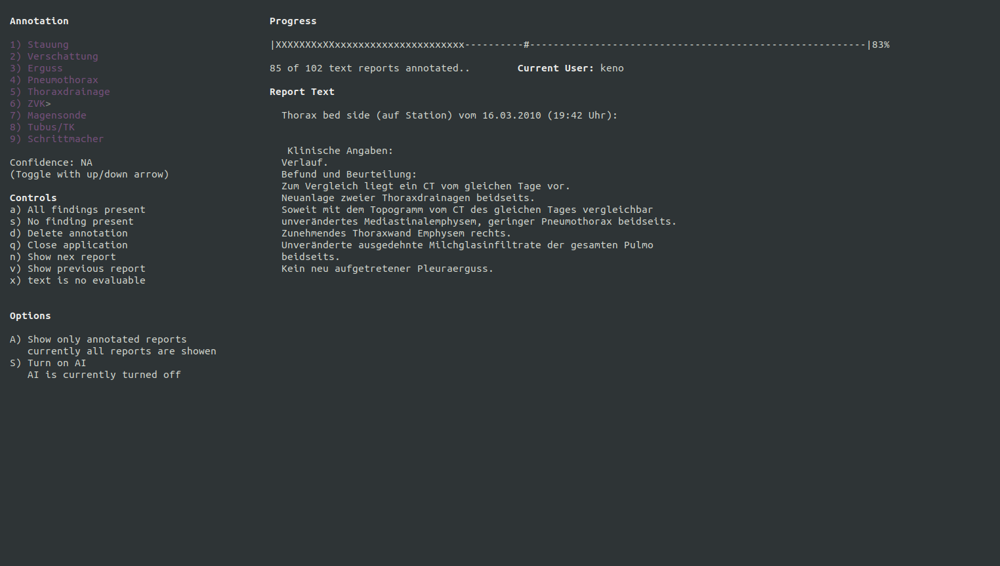

# A Simple Tool for the Classification of Radiological Text Data

This terminal program should help to quickly and accurately classify diagnostic texts, e.g. for thoracic images. At the moment, up to nine different findings can be classified. The names of the findings (e.g. effusion, pneumothorax) are directly imported from the csv-file containing the file-names. 

## Requirements 
Python 3.6  
Numpy 1.16.4  
Pandas 0.24.2  
Curses (pre-installed in Python on Ubuntu).
Unix operating system (Windows not yet supported).

## Setting up the programm
Clone or download this repository. Paste a csv-file (structure of the file described below) into the `data` folder of the project. Rename the csv-file to `file_dir.csv`. Open the main folder in a new terminal window. In Ubuntu, this can be done by a right click on the folder and by selecting `open in terminal`. Type `python3 simple-annotator.py` into your terminal. The terminal should be maximized in order to achieve an optimal display of the user interface and report texts. 
[BUG] Changing the size of the terminal while the annotator is running currently causes the program to crash.

## How it works

The basis is a csv file, e.g. with the following structure:  

               
    filename    | Congestion    | Pneumonia     | Effusion      | Pneumothorax  | Foreign Materials
    -------------------------------------------------------------------------------------
    13764005.txt| 1             | 1             | 0             | 0             | 0 
    13374201.txt| 1             | 0             | 0             | 0             | 1
    13740269.txt| -1            | -1            | -1            | -1            | -1
    12345678.txt| 0             | 0             | 1             | 1             | 1 
    10420000.txt|               |               |               |               | 
    
  1: finding is present  
  0: finding is not present  
 -1: unevaluable (always whole row)  
 <empty>: no annotation (NA)  
    
Each annotation is immediately stored in the csv-file.

## Using the program
After the start, you will be asked to enter your name. This allows you to follow the comments of different people. Please note, however, that currently no more than one annotation per file is possible, and previous annotations from another user (or the same user) will be overwritten. 

### Annotation
The annotations are displayed here. Magenta text means that there is no annotation yet (values are NA). After pressing a key for annotation (e.g. 1 for congestion), the corresponding line is highlighted (black writing on white background). White writing on a black background corresponds to the absence of the findings.   
  
There is also the possibility to rate one's confidence in the annotation between "low", "medium" and "high". The confidence rating is storend in a file called `data/log.txt`, next to the name of the annotator and the file name. The file is created at program start, if it does not already exist. 

### Controls
Explanation of the controls. The letter in front of the closed bracket corresponds to the key to be pressed. 

### Options
Further options. You can choose whether you want to display only files that have already been commented or only files that have not yet been commented. There is also a possibility to turn on an AI helper for annotation, which, however, is not yet implemented. 

### Progress bar
Some measurements of progress are given above the text reports. The flashing hash (`#`) indicates your current position in the loaded stack of text reports. A small "x" indicates that the report is annotated but the condifence rating is missing, a capital "X" indicates a full annotation including a confidence rating.  

### Report text
Text reports of radiological findings are displayed here. You can switch between the previous or next text with the arrow keys or `n` or `v`.
