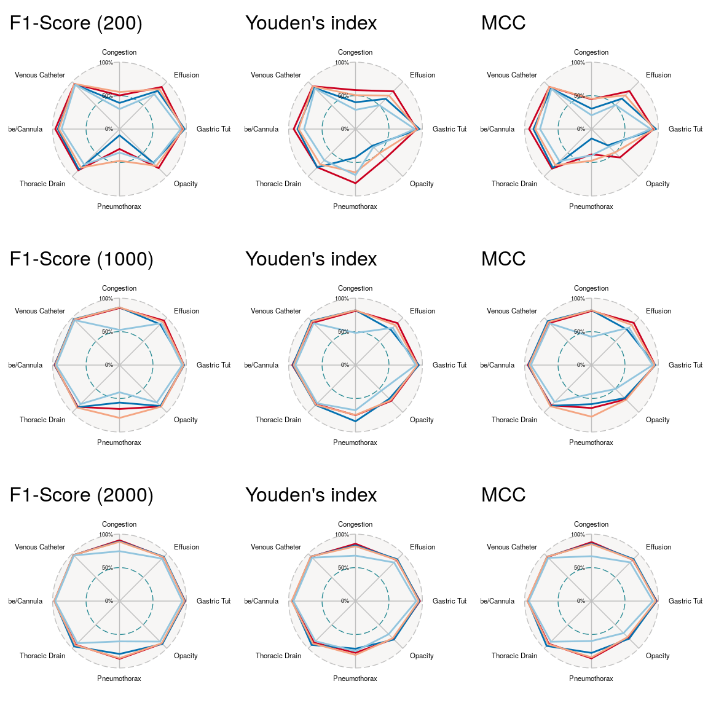
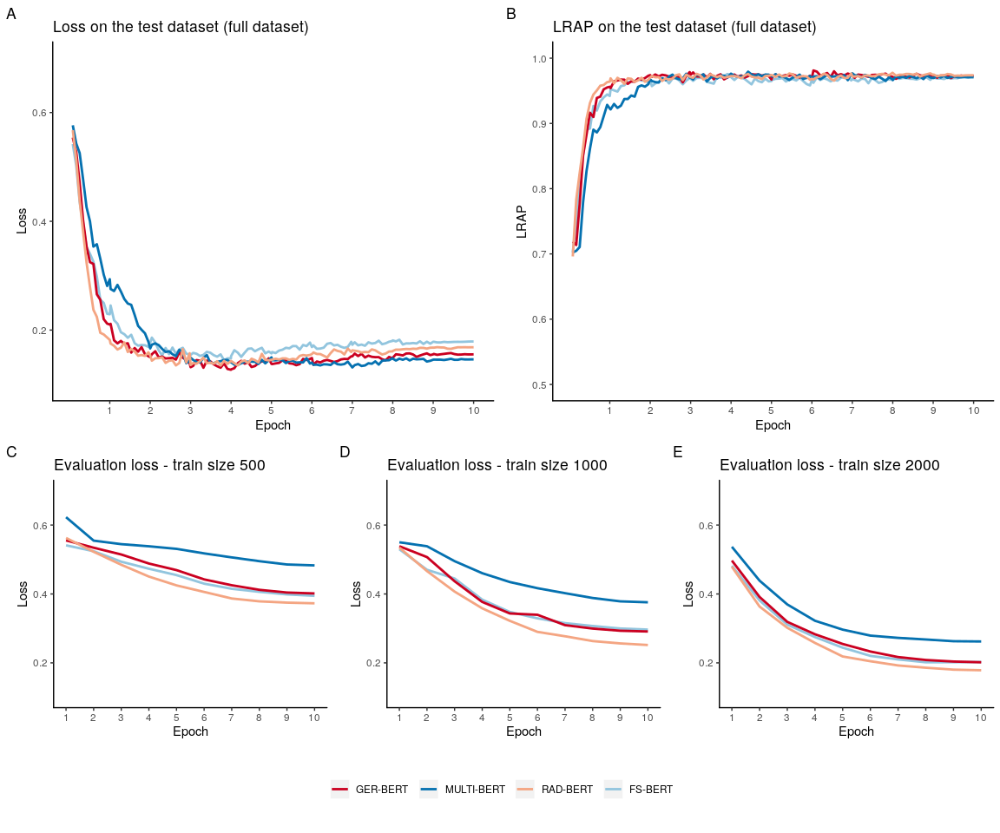
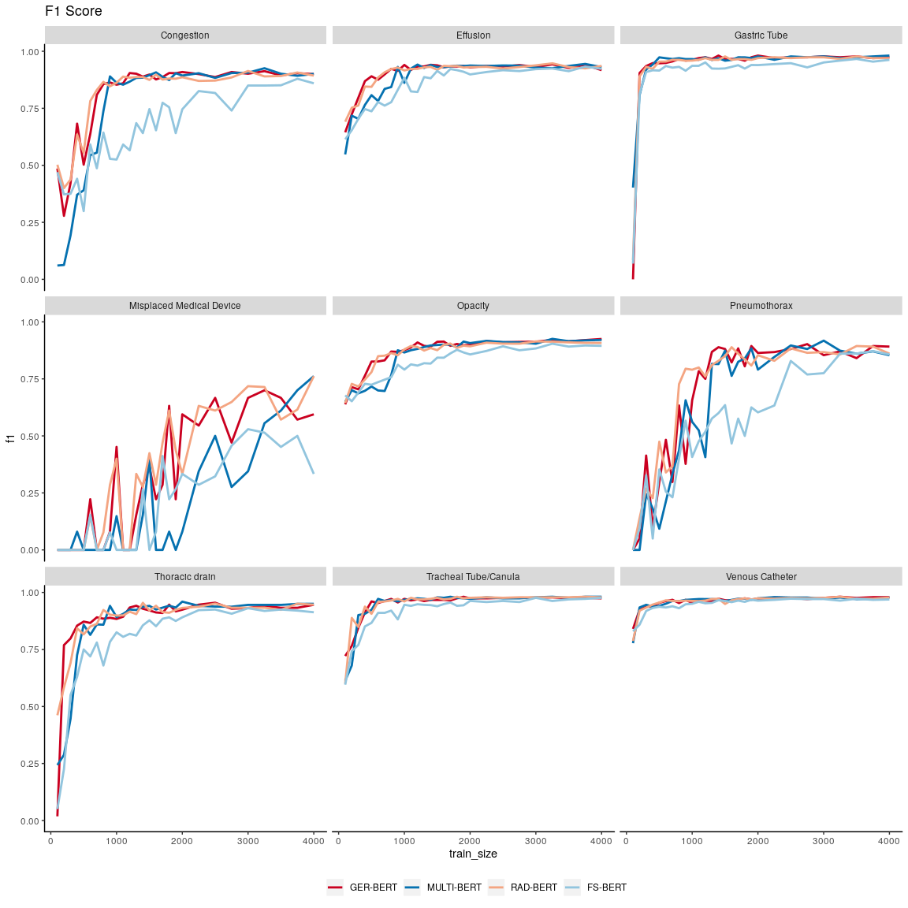
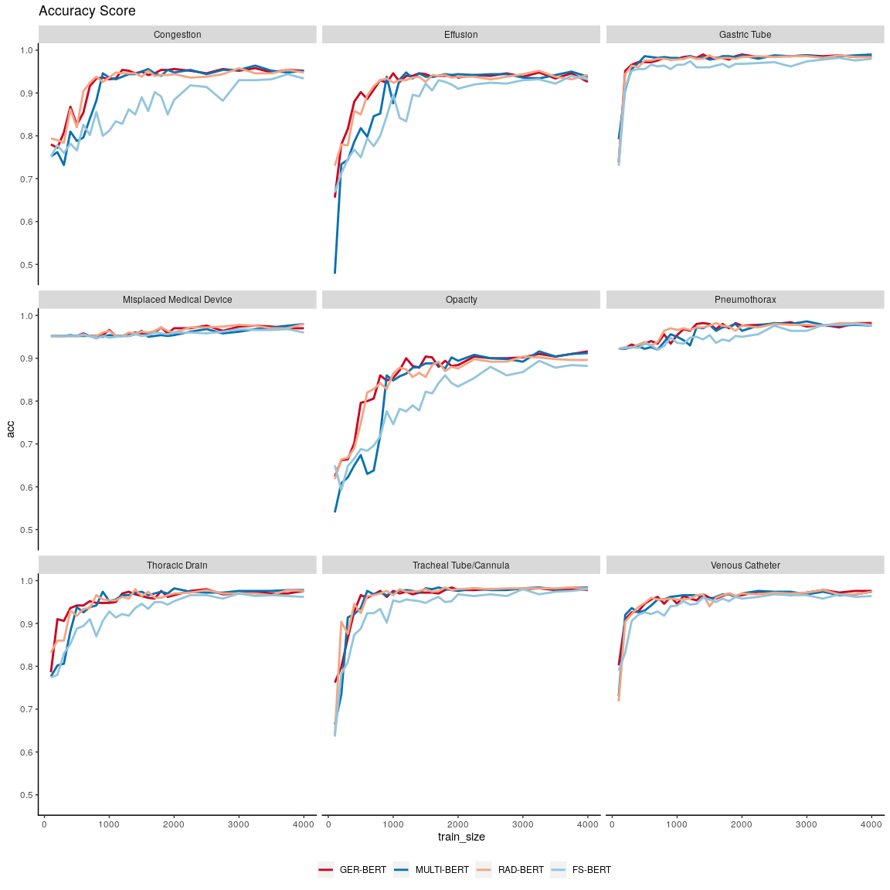
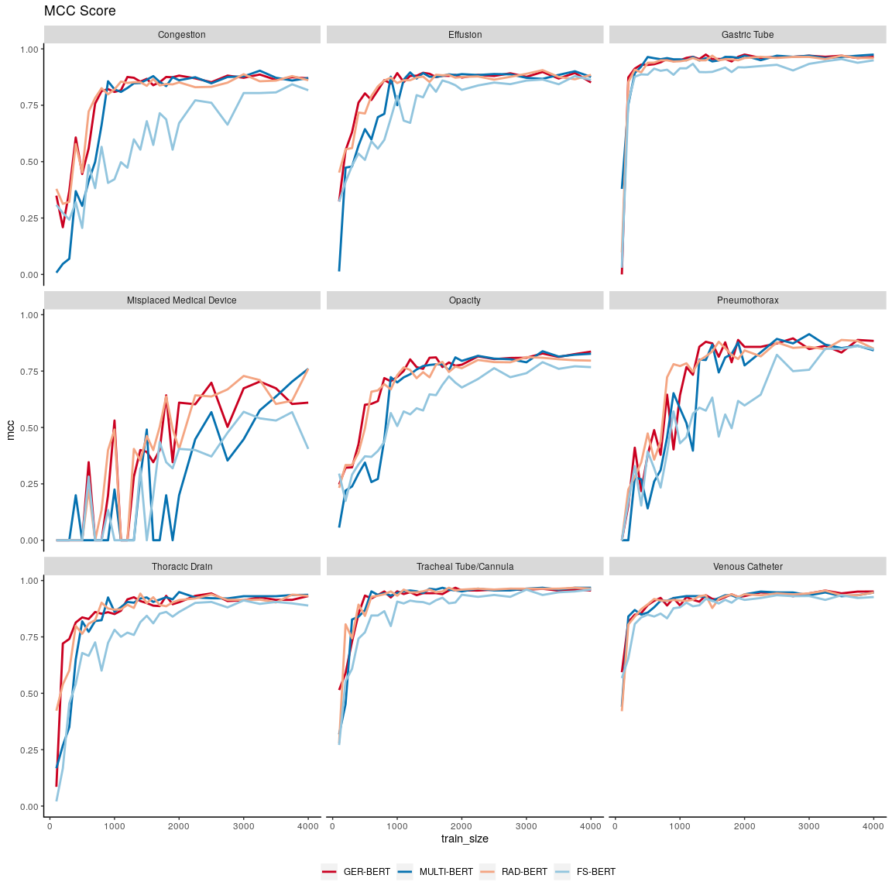
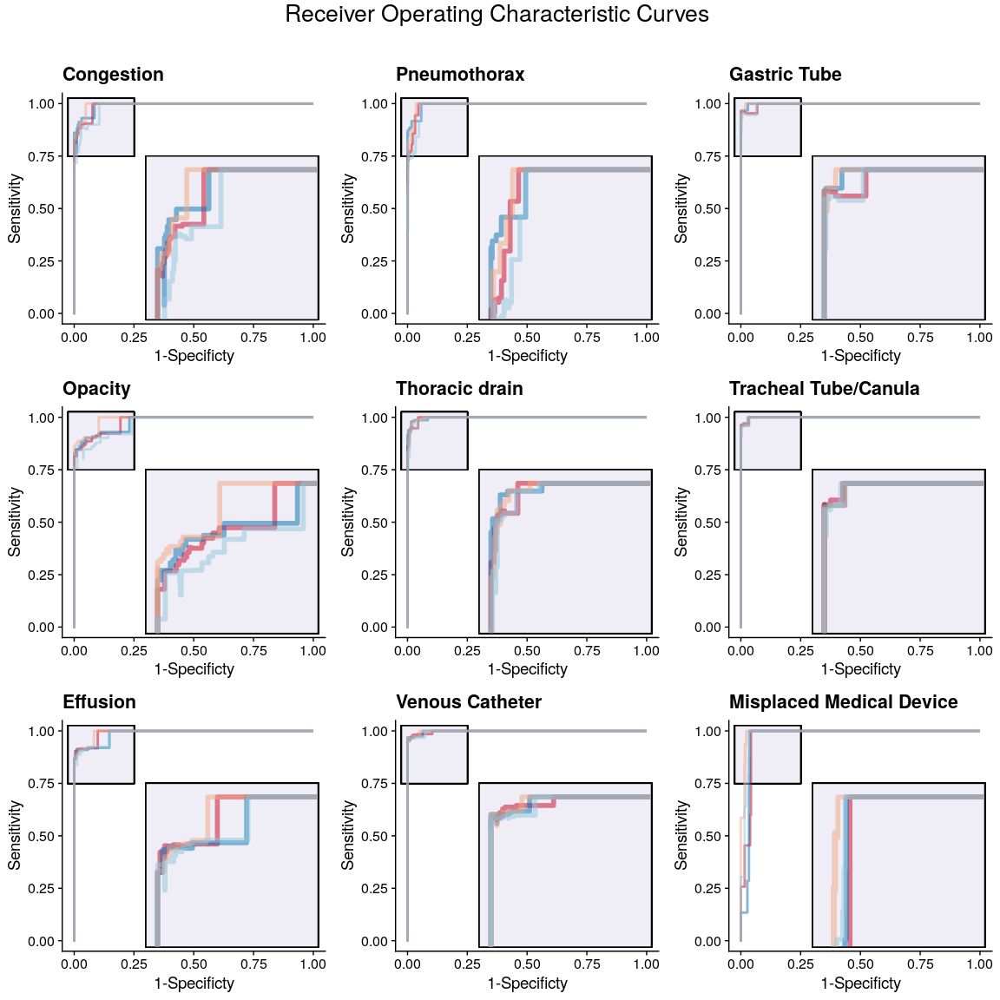
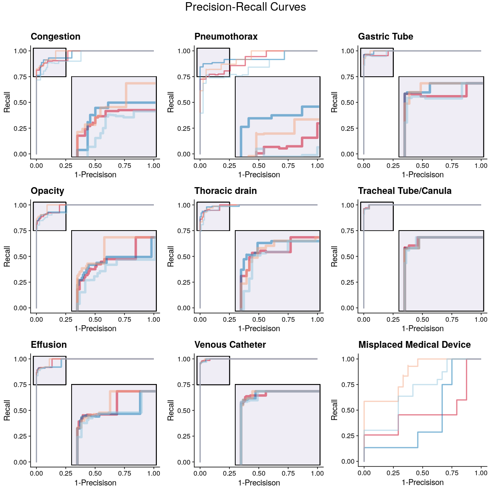

Evaluation of Model Performances
================

## 1\. Data wrangling

### Define helper functions

Function to convert the raw predictions to 0 or 1, depending on a chosen
threshold.

``` r
int_from_threshold <- function(.data, threshold) {
  mutate(.data, 
         Stauung = as.integer(Stauung > threshold),
         Verschattung = as.integer(Verschattung > threshold),
         Erguss = as.integer(Erguss > threshold),
         Pneumothorax = as.integer(Pneumothorax > threshold),
         Thoraxdrainage = as.integer(Thoraxdrainage > threshold),
         ZVK = as.integer(ZVK > threshold),
         Magensonde = as.integer(Magensonde > threshold),
         Tubus = as.integer(Tubus > threshold),
         Materialfehllage = as.integer(Materialfehllage > threshold))
}
```

Function to convert vectors of 0 and 1 to measurements from confusion
matrix.

``` r
confusionmatrix_measurements <- function(data) {
  
  get_x = function(pred, finding, ref=test) {
    ref=ref[finding]
    pred=pred[finding]
    tp <- sum(ref == pred & ref == 1)
    tn <- sum(ref == pred & ref == 0)
    fp <- sum(ref != pred & ref == 1)
    fn <- sum(ref != pred & ref == 0)
    c(tp, tn, fp, fn)
  }
  lapply(names(data), get_x, pred = data) %>% 
    do.call(rbind, .) %>% 
    as_tibble() %>% 
    set_names(c("tp", "tn", "fp", "fn")) %>% 
    mutate(finding =   c("Stauung", "Verschattung", "Erguss", "Pneumothorax", "Thoraxdrainage", "ZVK", "Magensonde", "Tubus", "Materialfehllage"))
}
```

Function to extract various performance
measurements.

``` r
numericcharacters <- function(x) !any(is.na(suppressWarnings(as.numeric(x)))) & is.character(x)

get_perf_measurements <- function(raw, threshold) {

  raw %>% 
    int_from_threshold(threshold) %>%
    group_by(model, train_size) %>% 
    nest()  %>% 
    mutate(data = map(data, confusionmatrix_measurements)) %>% 
    unnest(cols = data) %>%
    mutate(prec = tp / (tp + fp), 
           rec  = tp / (tp + fn),
           spec = tn / (fp + tn), 
           acc = (tp + tn)/(tp +fp + tn + fn), 
           mcc = mltools::mcc(TP=tp, FP=fp, TN=tn, FN=fn)) %>% 
    mutate(f1  = 2 * ((prec * rec) / (prec + rec)), 
           j_stat = rec + spec -1) %>% 
    mutate(f1 = ifelse(is.na(f1), 0, f1), 
           finding = str_replace_all(finding, c("Stauung" = "Congestion", 
                                                "Verschattung" = "Opacity", 
                                                "Erguss" = "Effusion", 
                                                "Tubus" = "Tracheal Tube/Canula", 
                                                "ZVK" = "Venous Catheter", 
                                                "Thoraxdrainage" = "Thoracic drain", 
                                                "Magensonde" = "Gastric Tube", 
                                                "Materialfehllage" = "Misplaced Medical Device"))) %>%
    mutate_if(numericcharacters, as.numeric) %>%
    ungroup()
}
```

Function to read and format the raw results data.

``` r
read_and_format_data <- function(path) {
read_csv(path) %>% 
  pivot_longer(-c(train_size, model)) %>%  # similar to reshape2::melt, makes a long dataframe
  na.omit() %>% # some empty columns ave been added while loading the dataset
  select(-name) %>% 
  mutate(value = str_remove_all(value, "\\[|\\]") %>% str_squish()) %>% # remove '[' and ']' from value string. Needs escape character to work with regrex
  separate(value, 
           c("Stauung", "Verschattung", "Erguss", "Pneumothorax", "Thoraxdrainage", "ZVK", "Magensonde", "Tubus", "Materialfehllage"), 
           sep = " ", 
           convert = TRUE)  # converts to numeric
}
```

### Load data

Load the test data.

``` r
test <- read_csv("../data/test.csv")
```

Load results from fine-tuning. Ignore warnings.

``` r
raw <- read_and_format_data("../finetuning/results.csv")
```

## 2\. Plots

### Radarplots

Function to simplify plotting.

``` r
radar_plot_fun <- function(...,size = 1000, title="NONE", min = 0, max = 1, data=acc) {
  mid = mean(c(min, max)) %>% round(2)
  lab <- paste(c(min, mid, max)*100, "%", sep ="")
  
filter(data, train_size == size) %>%
  select(c(..., "finding", "model")) %>%
  spread(key = finding, value =...) %>%   
  rename(group = model) %>%
  select(-"Misplaced Medical Device") %>% 
 # filter(group != "pt-radiobert-from-scratch") %>% 
  ggradar(group.point.size = 0, centre.y = 0, grid.min = min, grid.mid = mid, grid.max = max,
          values.radar = lab, legend.title = "", legend.position = "bottom",  plot.title = title, 
          axis.label.size = 3, grid.label.size = 3, group.line.width = 1) +
  theme(legend.position = 0) + 
  scale_color_manual(values = c("#ca0020", "#0571b0", "#f4a582", "#92c5de"), 
                     labels = c("GER-BERT", "MULTI-BERT", "RAD-BERT", "FS-BERT"), 
                      breaks = c("bert-base-german-cased", 
                                 "bert-base-multilingual-cased", 
                                 "pt-radiobert-base-german-cased", 
                                 "pt-radiobert-from-scratch"))
  
  
}
```

``` r
acc <- get_perf_measurements(raw, 0.5) %>% replace(is.na(.) | . < 0, 0)

grid.arrange(
  grobs = list(
    radar_plot_fun("f1", title="F1-Score (200)",size=500), 
    radar_plot_fun("j_stat", title="Youden's index",size=500),
    radar_plot_fun("mcc", title="MCC",size=500),
    
    radar_plot_fun("f1", title="F1-Score (1000)",size=1000), 
    radar_plot_fun("j_stat", title="Youden's index",size=1000),
    radar_plot_fun("mcc", title="MCC",size=1000),
    
    radar_plot_fun("f1", title="F1-Score (2000)",size=2000), 
    radar_plot_fun("j_stat", title="Youden's index",size=2000),
    radar_plot_fun("mcc", title="MCC",size=2000)),
  layout_matrix = rbind(1:3, 4:6, 7:9))
```

<!-- -->

### Plot the loss and LRAP against epochs/steps

``` r
loss <- read_csv("../finetuning/epochs.csv") %>%
  mutate(model = ifelse(str_detect(model, "rad"), "RAD-BERT", 
                        ifelse(str_detect(model, "ger"), "GER-BERT",
                               ifelse(str_detect(model, "fs"), "FS-BERT", 
                                      ifelse(str_detect(model, "multi"), "MULTI-BERT", model)
                                      )
                               )
                        )
         )
     
# 500 - 2000 train-size, number of steps/epoch was smaller than 50. Steps represent Epoch-Number in the dataframe. 

style <- list(theme(panel.grid = element_blank(), 
                    axis.line.x = element_line(size = 0.5, linetype = "solid", colour = "black"),
                    axis.line.y = element_line(size = 0.5, linetype = "solid", colour = "black"),
                    panel.border = element_blank(), 
                    panel.background = element_blank(), 
                    legend.title = element_blank(),
                    legend.position = "bottom"), 
              geom_line(size = 1), 
              ylim(0.1, 0.7),
              scale_color_manual(values = c("#92c5de", "#ca0020", "#0571b0", "#f4a582"), 
                                 breaks = c("GER-BERT", "MULTI-BERT", "RAD-BERT", "FS-BERT")))

p_loss <-  ggplot(filter(loss, data == "full"), aes(x = step, y = eval_loss, color = model)) + 
            style +   
            scale_x_continuous(breaks = c(588, 1176, 1764, 2352, 2940, 3528, 4116, 4704, 5292, 5880), # step reached at epoch
                               labels = 1:10) +
            labs(x="Epoch",y="Loss",title = "Loss on the test dataset (full dataset)", tag= "A")

legend <- get_legend(p_loss)
p_loss <- p_loss + theme(legend.position = 0)

p_lrap <-  ggplot(filter(loss, data == "full"), aes(x = step, y = lrap, color = model)) + 
            style + 
            scale_x_continuous(breaks = c(588, 1176, 1764, 2352, 2940, 3528, 4116, 4704, 5292, 5880), 
                               labels = 1:10) + ylim(0.5, 1) +
            labs(x="Epoch",y="LRAP",title = "LRAP on the test dataset (full dataset)", tag= "B") + theme(legend.position = 0)

loss_500 <-  ggplot(filter(loss, data == "500"), aes(x = step, y = eval_loss, color = model)) + 
            style + theme(legend.position = 0) + scale_x_continuous(breaks = 1:10) + 
            labs(x="Epoch",y="Loss",title = "Evaluation loss - train size 500", tag= "C")

loss_1000 <-  ggplot(filter(loss, data == "1000"), aes(x = step, y = eval_loss, color = model)) + 
            style + theme(legend.position = 0) + scale_x_continuous(breaks = 1:10) + 
            labs(x="Epoch",y="Loss",title = "Evaluation loss - train size 1000", tag= "D")

loss_2000 <-  ggplot(filter(loss, data == "2000"), aes(x = step, y = eval_loss, color = model)) + 
            style + theme(legend.position = 0) + scale_x_continuous(breaks = 1:10) + 
            labs(x="Epoch",y="Loss",title = "Evaluation loss - train size 2000", tag= "E")

ggdraw(
  plot_grid(
    plot_grid(p_loss, p_lrap, ncol=2, align='v'),
    plot_grid(loss_500, loss_1000, loss_2000, ncol = 3, nrow = 1, rel_widths = c(1, 1, 1)),
    plot_grid(NA, legend, NA, ncol = 3, nrow = 1, rel_widths = c(0.1, 1, 0.1)),
    nrow = 3, 
    rel_heights=c(1,0.7,0.2)))
```

<!-- -->

### Plot accuray on different train size

``` r
style <- list(theme(panel.grid = element_blank(), 
                    axis.line.x = element_line(size = 0.5, linetype = "solid", colour = "black"),
                    axis.line.y = element_line(size = 0.5, linetype = "solid", colour = "black"),
                    panel.border = element_blank(), 
                    panel.background = element_blank(), 
                    legend.title = element_blank(),
                    legend.position = "bottom"), 
              geom_line(size = 1), 
              scale_color_manual(values = c("#ca0020", "#0571b0", "#f4a582", "#92c5de"), 
                                 labels = c("GER-BERT", "MULTI-BERT", "RAD-BERT", "FS-BERT")))


ggplot(acc, aes(x=train_size, y=f1, color=model)) + 
  style + 
  facet_wrap(~finding) + 
  xlim(100,4000) +
  ggtitle("F1 Score")
```

<!-- -->

``` r
ggplot(acc, aes(x=train_size, y=acc, color=model)) + 
  style + 
  facet_wrap(~finding) + 
  xlim(100,4000) +
  ggtitle("Accuracy Score")
```

<!-- -->

``` r
ggplot(acc, aes(x=train_size, y=mcc, color=model)) + 
  style + 
  facet_wrap(~finding) + 
  xlim(100,4000) + 
  ggtitle("MCC Score")
```

<!-- -->

``` r
acc %>% 
  select(train_size, model, f1, mcc, j_stat) %>%
  group_by(train_size, model) %>%
  nest() %>% 
  mutate(data = map(data, mutate_if, is.numeric, mean)) %>%
  unnest() %>%  
  ungroup() %>%
  filter(!duplicated(.)) %>% 
  pivot_longer(-c(train_size, model)) %>%
  mutate(name = str_replace_all(name, 
                                c("f1|j_stat|mcc"), 
                                c("F1 Score", "Youden's statistik", "MCC"))) %>%
  ggplot(aes(x=train_size, y=value, color=model)) + 
    style + 
    facet_wrap(~name) + 
    xlim(100,4500) + 
    scale_y_continuous(breaks = 0:10/10) + 
    labs(x="Size of train dataset", title = "Performance gain on increasing train data") + 
    theme(axis.title.y = element_blank())
```

<!-- -->

### ROC Curves and Precision-Recall Curves

``` r
get_values <- function(threshold, size, raw) {
  filter(raw, train_size == size)  %>% 
    get_perf_measurements(threshold) %>% 
    select(c(finding, model, prec, rec, spec)) %>%
    mutate(thrshld = threshold)
}

auc <- function(sen, spe){
  sen = sort(sen)
  spe = sort(1-spe)
  dsen <- c(diff(sen), 0)
  dspe <- c(diff(spe), 0)
  sum(sen * dspe) + sum(dsen * dspe)/2
}


lapply(0:15/15, get_values, size = 4703, raw=raw) %>% 
  do.call(rbind, .) %>% 
  replace_na(list(spec = 1, rec = 1)) %>% 
  rbind(filter(., thrshld == 0) %>% mutate(prec = 0, spec = 0, rec = 1),  # extrapolate Plotlines 
        filter(., thrshld == 0) %>% mutate(prec = 1, spec = 1, rec = 0)) -> plot_df
```

``` r
plot_fun <- function(FINDING, df, type="AUC") {
  df %<>% filter(finding == FINDING)

  add <- list(theme_cowplot(), 
            theme(legend.position = 0), 
            scale_color_manual(values = c("#ca0020", "#0571b0", "#f4a582", "#92c5de"), 
                               labels = c("GER-BERT", "MULTI-BERT", "RAD-BERT", "FS-BERT"))) 

  if (type == "AUC") {
    main <- 
      ggplot(df, aes(x = 1-spec, y = rec, color = model)) + 
        labs(title = FINDING, y = "Sensitivity", x = "1-Specificty") + 
      add}
  
  if (type == "AUPRC") {
    main <- 
      ggplot(df, aes(x = 1-prec, y = rec, color = model)) + 
        labs(title = FINDING, y = "Recall", x = "1-Precisison") + 
      add}
  
  sub <- 
    main + geom_step(direction = "vh", size = 2, alpha = 0.5) + 
      coord_cartesian(ylim=c(0.75,1), xlim=c(0, 0.25)) +
      theme_nothing()
    
  main = main + 
    geom_rect(xmin=-0.025,xmax=0.25,ymin=0.75,ymax=1.025, fill = "#efedf5", linetype = 1, color = "#000000") +
    geom_rect(xmin=0.3,xmax=1.02,ymin=-0.03,ymax=0.75, fill = "#efedf5",  linetype = 1, color = "#000000") +
    geom_step(direction = "vh", size = 1, alpha = 0.5) 

  
  ggdraw() +
    draw_plot(main) + 
    draw_plot(sub, x = 0.45, y = 0.17, width = .5, height = .5)
}

grid.arrange(
  grobs = lapply(unique(plot_df$finding), plot_fun, plot_df, "AUC"), 
  layout_matrix = matrix(1:9, 3), 
  top=textGrob("Receiver Operating Characteristic Curves \n",gp=gpar(fontsize=20))
  )
```

<!-- -->

``` r
l <- lapply(unique(plot_df$finding)[1:8], plot_fun, plot_df, "AUPRC")
l[[9]] <-  plot_df %>% 
   filter(finding == "Misplaced Medical Device") %>%
   ggplot(aes(x = 1-prec, y = rec, color = model)) + 
      labs(title = "Misplaced Medical Device", y = "Recall", x = "1-Precisison") + 
      theme_cowplot() + 
      theme(legend.position = 0) + 
      scale_color_manual(values = c("#ca0020", "#0571b0", "#f4a582", "#92c5de"), 
                         labels = c("GER-BERT", "MULTI-BERT", "RAD-BERT", "FS-BERT")) + 
      geom_step(direction = "vh", size = 1, alpha = 0.5) 

grid.arrange(
  grobs = l,
  layout_matrix = matrix(1:9, 3), 
  top=textGrob("Precision-Recall Curves\n",gp=gpar(fontsize=20))
  )
```

<!-- -->

## 3\. Tables

### AUC

``` r
writeLines("train_size,Model,Finding,AUPRC,AUC", "auc.csv")

loop_auc <- function(df, train_size, out_file) {
  for (i in unique(df$model)) {
    for (j in unique(df$finding)) {
  
      x = filter(df, model == i & finding == j) %>% select(rec) %>% unlist()
      y = filter(df, model == i & finding == j) %>% select(prec) %>% unlist()
      z = filter(df, model == i & finding == j) %>% select(spec) %>% unlist()

      
    paste(train_size, 
          i, 
          j, 
          auc(x, y) %>% round(2), 
          auc(x, z) %>% round(2), 
          sep=",") %>% paste("\n", sep="") %>% cat(file=out_file, append = T)
    }
  }
}

for (size in c(200, 400, 600, 800, 1000, 1500, 2000, 4000, 4703)) {

lapply(0:15/15, get_values, size = size, raw=raw) %>% 
  do.call(rbind, .) %>% 
  replace_na(list(spec = 1, rec = 1)) %>% 
  rbind(filter(., thrshld == 0) %>% mutate(prec = 0, spec = 0, rec = 1),  # extrapolate Plotlines 
        filter(., thrshld == 0) %>% mutate(prec = 1, spec = 1, rec = 0)) %>%
  loop_auc(size, out_file="auc.csv")
}


read_csv("auc.csv") 
```

    ## # A tibble: 324 x 5
    ##    train_size Model                       Finding               AUPRC   AUC
    ##         <dbl> <chr>                       <chr>                 <dbl> <dbl>
    ##  1        200 pt-radiobert-base-german-c… Congestion             0.47  0.86
    ##  2        200 pt-radiobert-base-german-c… Opacity                0.7   0.81
    ##  3        200 pt-radiobert-base-german-c… Effusion               0.78  0.88
    ##  4        200 pt-radiobert-base-german-c… Pneumothorax           0.4   0.95
    ##  5        200 pt-radiobert-base-german-c… Thoracic drain         0.73  0.93
    ##  6        200 pt-radiobert-base-german-c… Venous Catheter        0.96  0.96
    ##  7        200 pt-radiobert-base-german-c… Gastric Tube           0.93  0.98
    ##  8        200 pt-radiobert-base-german-c… Tracheal Tube/Canula   0.91  0.96
    ##  9        200 pt-radiobert-base-german-c… Misplaced Medical De…  0.04  0.95
    ## 10        200 bert-base-german-cased      Congestion             0.48  0.86
    ## # … with 314 more rows

## 4\. Performance on long texts

``` r
test <- read_csv("../data/ct.csv")
raw <-read_and_format_data("../finetuning/results-long-text.csv") 
acc <- get_perf_measurements(raw, 0) %>% replace(is.na(.) | . < 0, 0) 

radar_plot_fun("mcc", title="mcc",size=4000) + 
       theme(legend.position = "bottom") + 
   scale_color_manual(values = c("#92c5de", "#ca0020", "#0571b0", "#f4a582"), 
                     labels = c("GER-BERT", "MULTI-BERT", "RAD-BERT", "FS-BERT"), 
                     breaks = c("gerbert", "multibert", "radbert", "fsbert")) + 
  ggtitle("MCC for CT-Reports")
```

<!-- -->

``` r
writeLines("train_size,Model,Finding,AUPRC,AUC", "auc-for-ct.csv")

lapply(0:15/15, get_values, size = 4000, raw=raw) %>% 
  do.call(rbind, .) %>% 
  replace_na(list(spec = 1, rec = 1)) %>% 
  rbind(filter(., thrshld == 0) %>% mutate(prec = 0, spec = 0, rec = 1),  # extrapolate Plotlines 
        filter(., thrshld == 0) %>% mutate(prec = 1, spec = 1, rec = 0)) %>%
  loop_auc(size,out_file = "auc-for-ct.csv")

read_csv("auc-for-ct.csv")
```

    ## # A tibble: 36 x 5
    ##    train_size Model   Finding                  AUPRC   AUC
    ##         <dbl> <chr>   <chr>                    <dbl> <dbl>
    ##  1       4703 radbert Congestion                0.77  0.9 
    ##  2       4703 radbert Opacity                   0.96  0.81
    ##  3       4703 radbert Effusion                  0.93  0.9 
    ##  4       4703 radbert Pneumothorax              0.75  0.93
    ##  5       4703 radbert Thoracic drain            0.88  0.93
    ##  6       4703 radbert Venous Catheter           0.86  0.89
    ##  7       4703 radbert Gastric Tube              0.71  0.84
    ##  8       4703 radbert Tracheal Tube/Canula      0.9   0.91
    ##  9       4703 radbert Misplaced Medical Device  0.4   0.77
    ## 10       4703 fsbert  Congestion                0.47  0.81
    ## # … with 26 more rows
